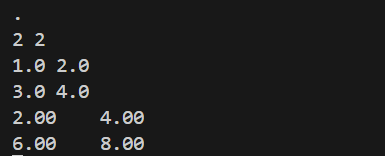
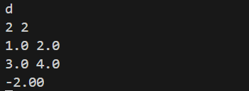

# 矩阵运算库

## 简介
本项目实现了一个简单的矩阵运算库，支持矩阵的加法、减法、乘法、标量乘法、转置、行列式、逆矩阵、矩阵的秩和迹的计算。

## 功能实现思路
### 矩阵加法
使用 `add_matrix` 函数，对两个矩阵进行元素逐个相加，需要保证两个矩阵的行和列数相同。

### 矩阵减法
使用 `sub_matrix` 函数，对两个矩阵进行元素逐个相减，同样需要保证两个矩阵的行和列数相同。

### 矩阵乘法
使用 `mul_matrix` 函数，实现两个矩阵的乘法，要求第一个矩阵的列数等于第二个矩阵的行数，通过内层循环进行矩阵元素的乘积求和。

### 标量乘法
使用 `scale_matrix` 函数，将矩阵中的每个元素乘以一个标量。

### 矩阵转置
使用 `transpose_matrix` 函数，将矩阵的行和列进行互换。

### 计算行列式
使用 `det_matrix` 函数，递归计算方阵的行列式，对2x2及更小的矩阵有特定处理。

### 矩阵求逆
使用 `inv_matrix` 函数，先计算矩阵的行列式，若行列式不为0，则计算伴随矩阵并除以行列式得到逆矩阵。

### 矩阵的秩
使用 `rank_matrix` 函数，通过高斯消元法计算矩阵的秩。

### 计算迹
使用 `trace_matrix` 函数，对方阵的对角线元素求和得到迹。

## 截图
所有函数测试结果的截图均已插入相应部分，供参考。
